-- Table
CREATE TABLE Students (
  student_id SERIAL PRIMARY KEY,
  name VARCHAR(100) NOT NULL,
  email VARCHAR(100) UNIQUE NOT NULL,
  major VARCHAR(100),
  year INTEGER CHECK (year BETWEEN 1 AND 5)
);

CREATE TABLE Courses (
  course_id SERIAL PRIMARY KEY,
  course_code VARCHAR(10) UNIQUE NOT NULL,
  title VARCHAR(200) NOT NULL,
  credits INTEGER CHECK (credits > 0),
  department VARCHAR(100) NOT NULL
);

CREATE TABLE Professors (
  professor_id SERIAL PRIMARY KEY,
  name VARCHAR(100) NOT NULL,
  email VARCHAR(100) UNIQUE NOT NULL,
  department VARCHAR(100),
  office VARCHAR(50)
);

CREATE TABLE CourseOfferings (
  offering_id SERIAL PRIMARY KEY,
  course_id INTEGER REFERENCES Courses(course_id),
  professor_id INTEGER REFERENCES Professors(professor_id),
  semester VARCHAR(20) NOT NULL,
  year INTEGER NOT NULL
);

CREATE TABLE Enrollments (
  enrollment_id SERIAL PRIMARY KEY,
  student_id INTEGER REFERENCES Students(student_id),
  course_id INTEGER REFERENCES Courses(course_id),
  semester VARCHAR(20),
  grade VARCHAR(2)
);

-- Insert Statements
INSERT INTO Students (name, email, major, year)
VALUES
  ('Cung Nguyen', 'cung.nguyen@ocu.edu', 'Computer Science', 3),
  ('Ariana Grande', 'ariana.grande@ocu.edu', 'Dance Management', 2),
  ('Justin Bieber', 'justin.bieber@ocu.edu', 'Business Administration', 3),
  ('Travis Scott', 'travis.scott@ocu.edu', 'Data Analytics', 4),
  ('Bruno Mars', 'bruno.mars@ocu.edu', 'Economics', 2);

INSERT INTO Courses (course_code, title, credits, department)
VALUES
  ('CSCI6333', 'FRONTEND WEB DEVELOPMENT', 3, 'Computer Science'),
  ('CSCI6313', 'HTML/CSS/JAVA SCRIPT', 3, 'Computer Science'),
  ('CSCI5603', 'DATABASE DESIGN', 3, 'Computer Science'),
  ('CSCI6322', 'BACKEND DEVELOPMENT', 3, 'Computer Science');

INSERT INTO Professors (name, email, department, office)
VALUES
  ('Kantumuchu Avanti', 'avanti.kantumuchu@ocu.edu', 'Computer Science', 'Room 205'),
  ('Reed Bobby', 'reed.bobby@ocu.edu', 'Computer Science', 'Room 207'),
  ('Max Well', 'max.well@ocu.edu', 'Computer Science', 'Room 210');

INSERT INTO CourseOfferings (course_id, professor_id, semester, year)
VALUES
  (1, 1, 'Fall', 2025),
  (2, 2, 'Fall', 2025),
  (3, 3, 'Spring', 2025),
  (4, 1, 'Spring', 2025);

INSERT INTO Enrollments (student_id, course_id, semester, grade)
VALUES
  (1, 1, 'Fall', 'A'),
  (1, 3, 'Spring', 'A'),
  (2, 1, 'Fall', 'B'),
  (3, 2, 'Fall', 'A'),
  (4, 4, 'Spring', 'B'),
  (5, 3, 'Spring', NULL);

-- Query
-- List all students with their majors
SELECT name, major, year FROM Students;

-- Show which courses each student is enrolled in (use JOIN)
SELECT s.name AS student_name,
       c.title AS course_title,
       e.semester,
       e.grade
FROM Enrollments e
JOIN Students s ON e.student_id = s.student_id
JOIN Courses c ON e.course_id = c.course_id
ORDER BY s.name;

-- Find which professor teaches which course (use JOIN with CourseOfferings)
SELECT p.name AS professor_name,
       c.course_code,
       c.title AS course_title,
       co.semester,
       co.year
FROM CourseOfferings co
JOIN Courses c ON co.course_id = c.course_id
JOIN Professors p ON co.professor_id = p.professor_id
ORDER BY c.course_code;

-- Count how many students are in each course (use GROUP BY)
SELECT c.title AS course_title,
       COUNT(e.student_id) AS total_students
FROM Enrollments e
JOIN Courses c ON e.course_id = c.course_id
GROUP BY c.title

-- Your choice: Write one additional query demonstrating a concept from class
-- Students who earned grade 'A'
SELECT s.name, c.title, e.grade
FROM Enrollments e
JOIN Students s ON e.student_id = s.student_id
JOIN Courses c ON e.course_id = c.course_id
WHERE e.grade = 'A';

#Screenshots
1. CREATE TABLE
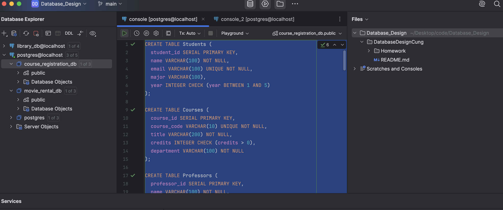

2. Sample data
- Students
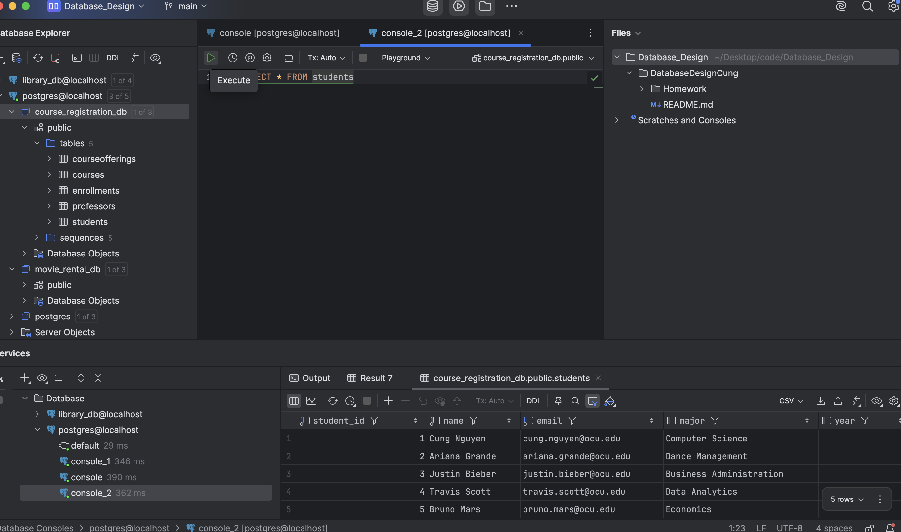

- Courses
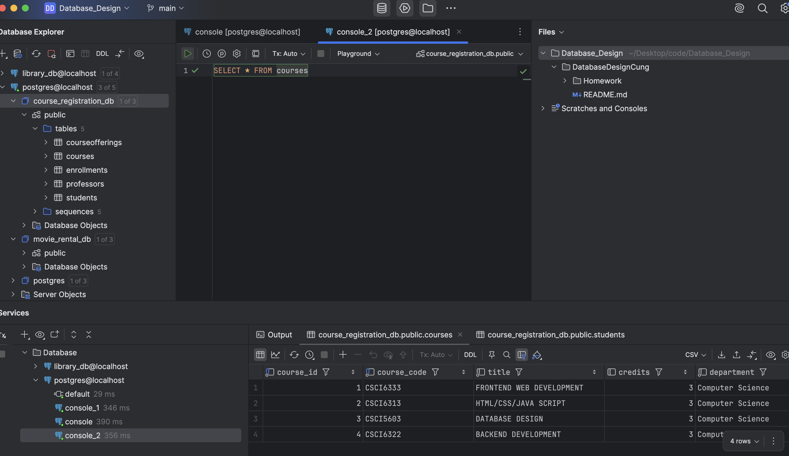

- Professors
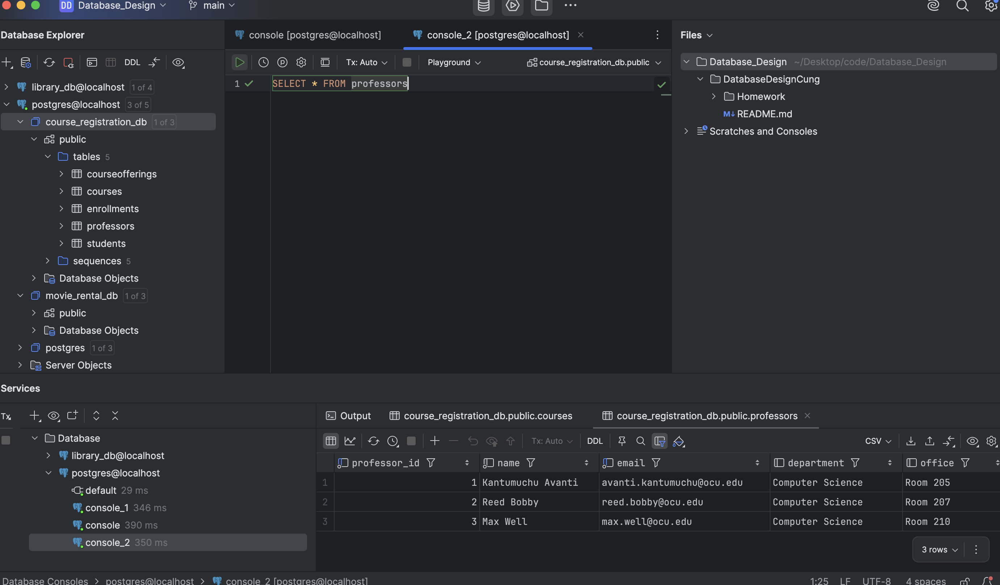

- Enrollments
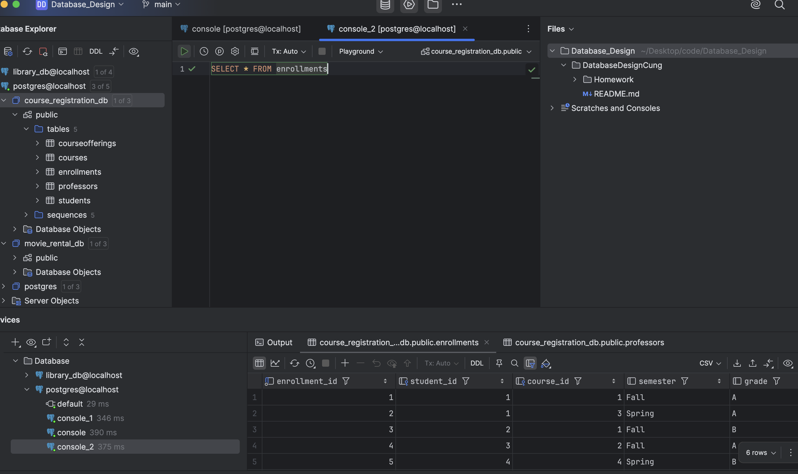

- CourseOfferings
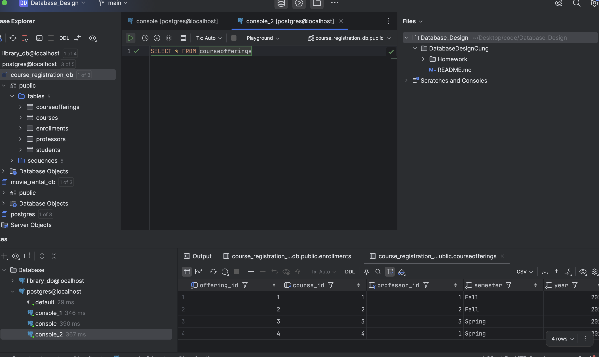

3. 5 query results
- List all students with their majors
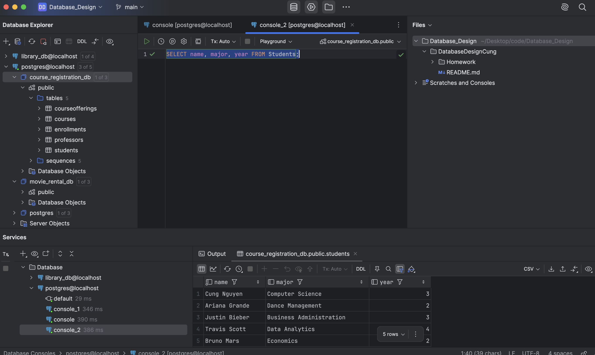

- Show which courses each student is enrolled in (use JOIN)
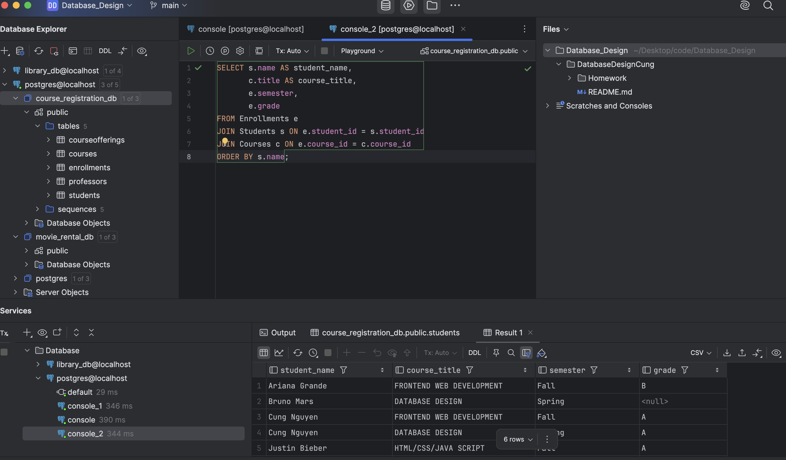

- Find which professor teaches which course (use JOIN with CourseOfferings)
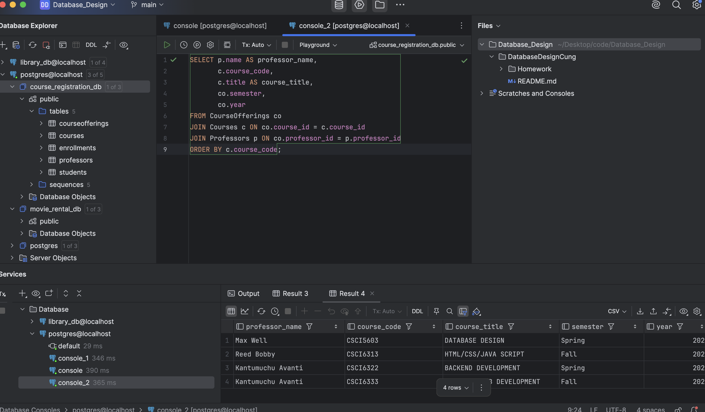

- Count how many students are in each course (use GROUP BY)
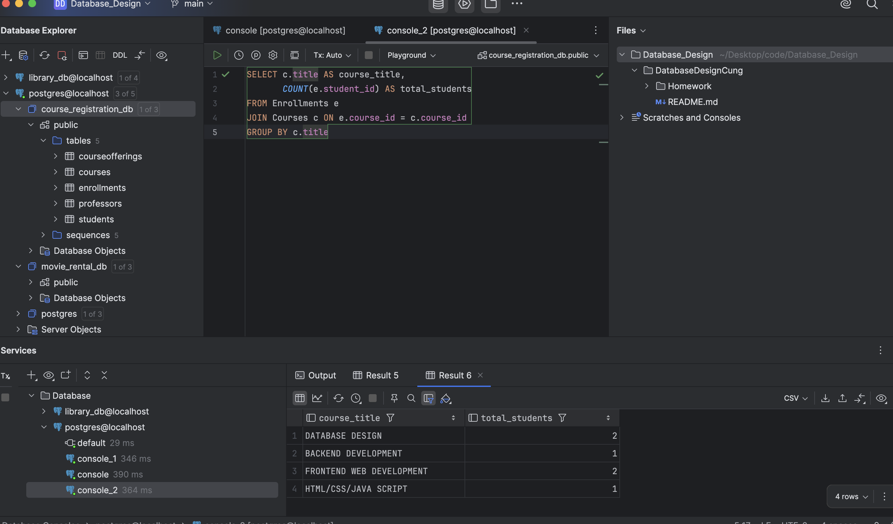

- Students who earned grade 'A'
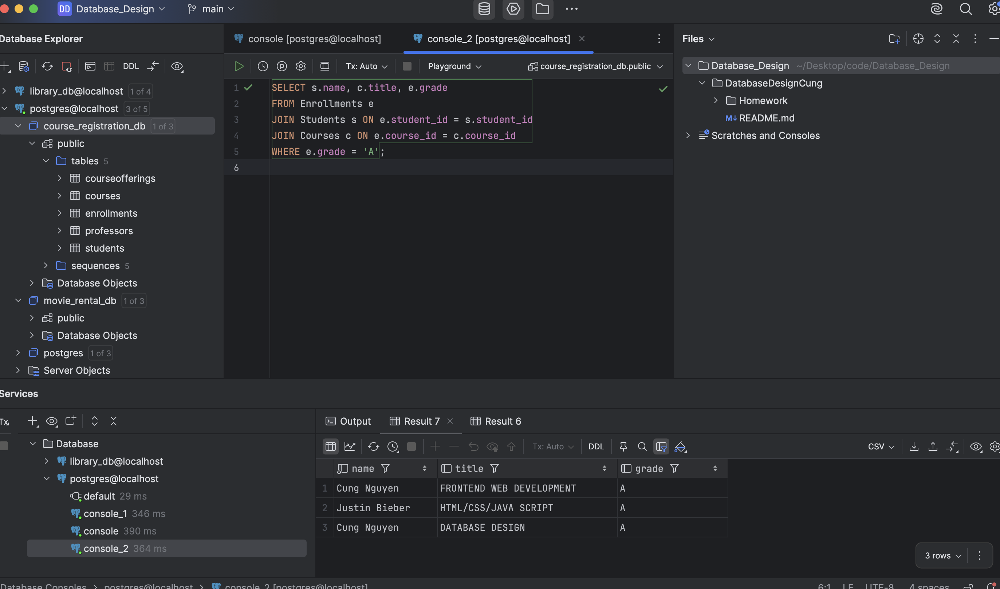
