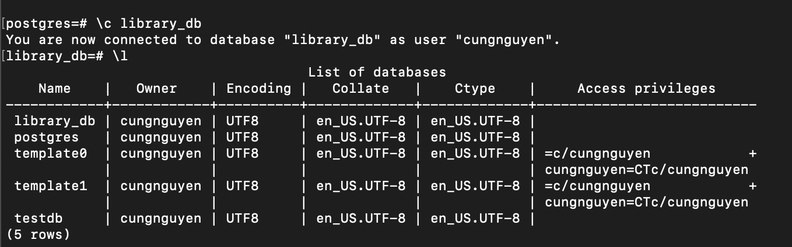
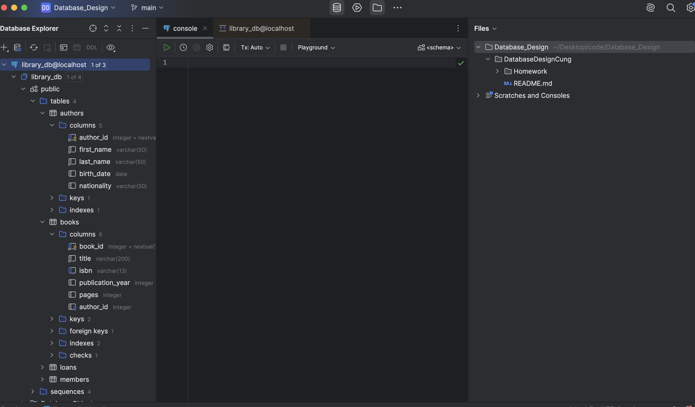
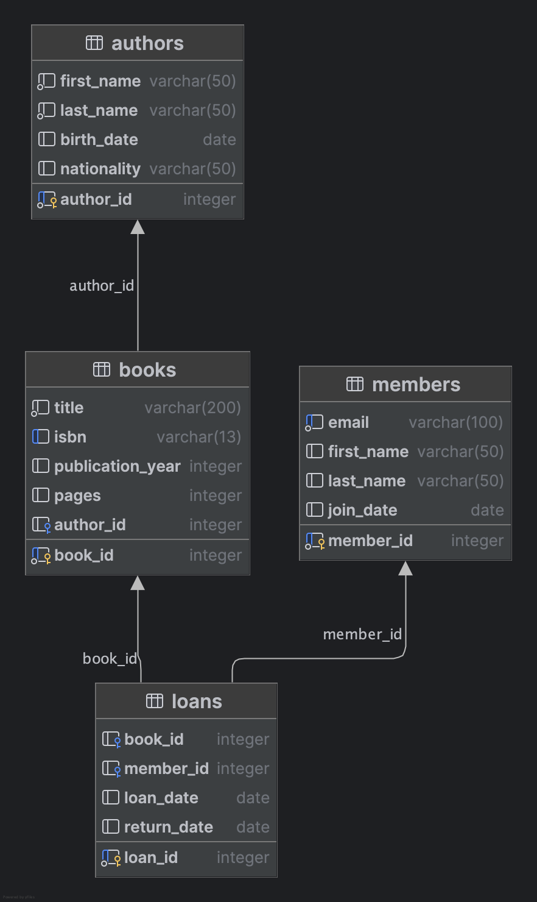

1. Screenshot of CLI PostgreSQL connection

3. Screenshot of DataGrip with database

4. DataGrip ER diagram

5. Your 5 SQL queries with results
List all members and their join dates: 

SELECT first_name || ' ' || last_name AS full_name, join_date FROM members ORDER BY join_date DESC; 

Find all books that have never been borrowed: 

SELECT b.title FROM books b LEFT JOIN loans l ON b.book_id = l.book_id WHERE l.loan_id IS NULL; 

List authors by nationality: 

SELECT nationality, COUNT(author_id) AS author_count FROM authors GROUP BY nationality ORDER BY author_count DESC; 

Find books published in the 20th century (1900–1999): 

SELECT title, publication_year 

FROM books 

WHERE publication_year BETWEEN 1900 AND 1999 

ORDER BY publication_year; 

Find all books with more than 500 pages 

SELECT title, pages 

FROM books 

WHERE pages > 400 

ORDER BY pages DESC; 
6. Brief reflection (200 words) on setup challenges
With the kind support of Mr. Bobby, the setup process became much easier. He helped me when I struggled to connect DataGrip to my local PostgreSQL database, especially with configuring the correct connection settings. Once that issue was solved, everything else went smoothly. I didn’t face many other difficulties during the setup, and I learned more about how database tools connect to local servers. Overall, the experience was straightforward and valuable, and I really appreciate Mr. Bobby’s help in making the process clear and efficient. 
